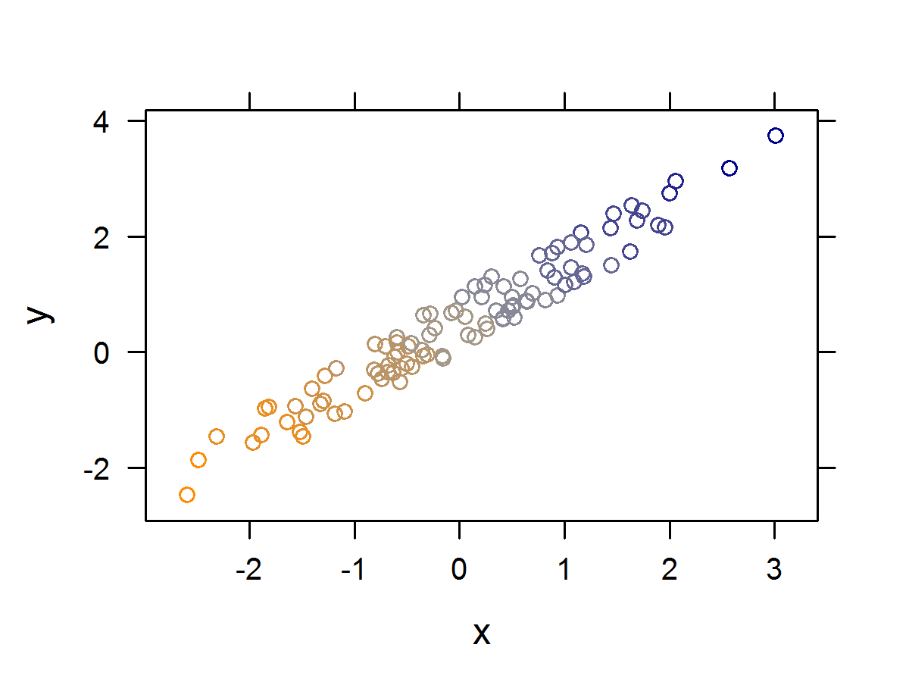

<!--
%\VignetteEngine{knitr}
%\VignetteIndexEntry{Introduction to Kmisc}
-->

<link rel="stylesheet" href="markdown.css">

Quick Introduction to Kmisc
=====

Kmisc introduces a bunch of utility functions to make the R coding experience
a bit easier. Some of the most useful functions in the package are shown here.


```r
set.seed(123)
suppressPackageStartupMessages( library(Kmisc) )
dat <- data.frame( x=letters[1:4], y=1:4, z=LETTERS[1:4] )
```


`without`: This function is used to remove columns from a `list` / `data.frame`.


```r
## let's remove columns 'x' and 'z' from dat.
dat[ !(names(dat) %in% c('x', 'z')) ]
```

```
##   y
## 1 1
## 2 2
## 3 3
## 4 4
```

```r

## I always find that syntax awkward. Let's use Kmisc::without instead.
without( dat, x, z )
```

```
##   y
## 1 1
## 2 2
## 3 3
## 4 4
```

```r

## what if there is a variable 'x' in the global environment?
x <- "a"
without( dat, x, z )
```

```
##   y
## 1 1
## 2 2
## 3 3
## 4 4
```

```r
## finally, we can also index by $ (note: NOT done by partial matching):
without( dat, dat$x, dat$z )
```

```
##   y
## 1 1
## 2 2
## 3 3
## 4 4
```

```r
## this could be handy for vectors with very long names, if using an IDE with
## auto-complete
```


`extract`: Extract vectors from a data.frame or list. Although there is already
a good subsetting syntax for lists and vectors, I wanted a complementary
function for `without`.


```r
extract( dat, x, y)
```

```
##   x y
## 1 a 1
## 2 b 2
## 3 c 3
## 4 d 4
```


`without.re, extract.re`: Extract variables whose names don't match / do match
a regular expression pattern.

```r
extract.re( dat, "[xy]")
```

```
##   x y
## 1 a 1
## 2 b 2
## 3 c 3
## 4 d 4
```

```r
without.re( dat, "[xy]")
```

```
##   z
## 1 A
## 2 B
## 3 C
## 4 D
```


`swap`: Replace elements in a vector.


```r
tDat <- dat ## make a temporary copy of dat

## Replace some elements in tDat$y
tDat$y <- swap( tDat$y, from=c(2, 4), to=c(20, 40) )
cbind( dat$y, tDat$y )
```

```
##      [,1] [,2]
## [1,]    1    1
## [2,]    2   20
## [3,]    3    3
## [4,]    4   40
```


`factor_to_char`, `char_to_factor`: A set of functions that recurse through
a list / data.frame and set all elements that are characters to factors,
and vice versa.


```r
bDat <- data.frame( x=rnorm(10), y=sample(letters,10), z=sample(letters,10) )
str( bDat )
```

```
## 'data.frame':	10 obs. of  3 variables:
##  $ x: num  -0.5605 -0.2302 1.5587 0.0705 0.1293 ...
##  $ y: Factor w/ 10 levels "c","f","k","l",..: 10 7 6 9 5 8 3 4 2 1
##  $ z: Factor w/ 10 levels "a","d","e","f",..: 10 9 7 8 1 5 6 3 4 2
```

```r
str( factor_to_char(bDat) )
```

```
## 'data.frame':	10 obs. of  3 variables:
##  $ x: num  -0.5605 -0.2302 1.5587 0.0705 0.1293 ...
##  $ y: chr  "x" "r" "p" "w" ...
##  $ z: chr  "z" "w" "q" "s" ...
```


`dapply`: The `data.frame` version of the `l/sapply` series of functions.

Why have this function when `sapply` still does much the same? I always get
frustrated with the fact that either an `array` or a `list` is returned
by sapply, but never a `data.frame`.


```r

dat <- data.frame( x = rnorm(100), y = rnorm(100), z = rnorm(100) )
dapply( dat, summary )
```

```
##                x       y       z
## Min.    -2.31000 -2.0500 -2.0100
## 1st Qu. -0.62600 -0.7280 -0.5740
## Median  -0.05870 -0.2060  0.0535
## Mean    -0.00979 -0.0238  0.1010
## 3rd Qu.  0.56200  0.5720  0.7790
## Max.     2.19000  3.2400  2.2900
```


`kMerge`: Left joins, aka. `merge( all.x=TRUE, ... )` without any mangling 
of the order.


```r
dat1 <- data.frame( id=5:1, x=c("a","a","b","b","b"), y=rnorm(5) )
dat2 <- data.frame( id=c(1, 2, 4), z=rnorm(3) )

## default merge changes id order
merge( dat1, dat2, by="id", all.x=TRUE )
```

```
##   id x       y        z
## 1  1 b -0.5229  0.68375
## 2  2 b  0.6608 -0.06082
## 3  3 b -1.3388       NA
## 4  4 a  1.2181  0.63296
## 5  5 a  0.2374       NA
```

```r
## even the sort parameter can't save you
merge( dat1, dat2, by="id", all.x=TRUE, sort=TRUE )
```

```
##   id x       y        z
## 1  1 b -0.5229  0.68375
## 2  2 b  0.6608 -0.06082
## 3  3 b -1.3388       NA
## 4  4 a  1.2181  0.63296
## 5  5 a  0.2374       NA
```

```r
# kMerge keeps it as is
kMerge( dat1, dat2, by="id" )
```

```
##   id x       y        z
## 1  5 a  0.2374       NA
## 2  4 a  1.2181  0.63296
## 3  3 b -1.3388       NA
## 4  2 b  0.6608 -0.06082
## 5  1 b -0.5229  0.68375
```


`in_interval`: A fast C implementation for determing which elements of a 
vector `x` lie within an interval `[lo, hi)`.


```r
x <- runif(10); lo <- 0.5; hi <- 1
print( data.frame( x=x, inner=in_interval(x, lo, hi) ) )
```

```
##          x inner
## 1  0.90915  TRUE
## 2  0.05638 FALSE
## 3  0.50291  TRUE
## 4  0.35054 FALSE
## 5  0.84556  TRUE
## 6  0.80644  TRUE
## 7  0.11733 FALSE
## 8  0.71269  TRUE
## 9  0.23527 FALSE
## 10 0.07496 FALSE
```


`stack_list`: Use this to stack data.frames in a list. This can be useful if
e.g. you've run some kind of bootstrap procedure and have all your results
stored in as a list of data.frames -- even `do.call( rbind, dfs )` can be slow.
The difference is even more prominent when used on very large lists.


```r
dfs <- replicate(1E3, 
                 data.frame(x=rnorm(10), y=sample(letters,10), z=sample(LETTERS,10)),
                 simplify=FALSE
                 )
str( stack_list(dfs) )
```

```
## 'data.frame':	10000 obs. of  4 variables:
##  $ x         : num  1.519 0.377 -2.052 -1.364 -0.201 ...
##  $ y         : chr  "n" "e" "l" "f" ...
##  $ z         : chr  "E" "C" "K" "I" ...
##  $ list_index: int  1 1 1 1 1 1 1 1 1 1 ...
```

```r
system.time( stack_list(dfs) )
```

```
##    user  system elapsed 
##    0.02    0.00    0.02
```

```r
system.time( do.call(rbind, dfs) )
```

```
##    user  system elapsed 
##    0.23    0.00    0.24
```


Fast String Operations
-----

For whatever reason, R is missing some nice builtin 'string' functions. I've
introduced a few functions, implemented in C for speed, for two common
string operations.

`str_rev`: Reverses a character vector; ie, a vector of strings.
`str_rev2` is there if you need to reverse a potentially unicode string.


```r
str_rev( c("ABC", "DEF", NA, paste(LETTERS, collapse="") ) )
```

```
## [1] "CBA"                        "FED"                       
## [3] NA                           "ZYXWVUTSRQPONMLKJIHGFEDCBA"
```


`str_slice`: Slices a vector of strings at consecutive indices `n`.
`str_slice2` exists for potentially unicode strings.

```r
str_slice( c("ABCDEF", "GHIJKL", "MNOP", "QR"), 2 )
```

```
## [[1]]
## [1] "AB" "CD" "EF"
## 
## [[2]]
## [1] "GH" "IJ" "KL"
## 
## [[3]]
## [1] "MN" "OP"
## 
## [[4]]
## [1] "QR"
```


`str_sort`: sort a string.

```r
str_sort("asnoighewgypfuiweb")
```

```
## [1] "abeefgghiinopsuwwy"
```


The cool R Markdown / HTML Stuff
-----

The real point of releasing this package is due to the HTML helper functions
I've made. I've found them especially useful in laying out R Markdown documents,
and also controlling more finely CSS styling and such.

`makeHTMLTable`: Converts a `data.frame` or `matrix` into an HTML table.
Best seen with an example. Note that we require `results='asis'` in the chunk
options.


```r
dat <- data.frame(apple = c("a", "b", "c"), banana = c(1, 2, 3))
makeHTMLTable(dat, use.col.names = TRUE)
```

<table ><tr><td>apple</td><td>banana</td></tr><tr><td>a</td><td>1</td></tr><tr><td>b</td><td>2</td></tr><tr><td>c</td><td>3</td></tr></table> 


`kTable`: Generated 1D and 2D (contingency) tables, which are then typically
passed through `makeHTMLtable` for 1D tables, or `pxt` for 2D tables.


```r
x <- factor( rbinom(100, 2, 0.2) )
y <- factor( rbinom(100, 3, 0.3) )

p1t( kTable( x, top.left.cell="foo" ) )
```

<table class='oneDtable' ><tr><td >foo</td><td >Count (%)</td></tr><tr><td >0</td><td >61 (61.0%)</td></tr><tr><td >1</td><td >36 (36.0%)</td></tr><tr><td >2</td><td > 3 (3.00%)</td></tr><tr><td >Total</td><td >100</td></tr></table> 

```r
pxt( kTable(x, y, 
            top.left.cell="foo", 
            top.label="bar", 
            left.label="baz" 
            ) )
```

<table class='twoDtable' ><tr><td colspan=2 rowspan=2 >foo</td><td colspan=4 >bar</td><td ></td></tr><tr><td >0</td><td >1</td><td >2</td><td >3</td><td >Total</td></tr><tr><td rowspan=3 >baz</td><td >0</td><td >17 (58.6%)</td><td >25 (59.5%)</td><td >17 (65.3%)</td><td >2 (66.6%)</td><td >61</td></tr><tr><td >1</td><td >10 (34.4%)</td><td >16 (38.0%)</td><td > 9 (34.6%)</td><td >1 (33.3%)</td><td >36</td></tr><tr><td >2</td><td > 2 (6.89%)</td><td > 1 (2.38%)</td><td > 0 (0.00%)</td><td >0 (0.00%)</td><td >3</td></tr><tr><td ></td><td >Total</td><td >29</td><td >42</td><td >26</td><td >3</td><td >100</td></tr></table> 


`kTable` with `google=TRUE`: Generate a 1D table output with the `googleVis`
package.


```r
suppressPackageStartupMessages( library(googleVis) )
tmp <- gvisTable( kTable(x, google=TRUE) )
cat( tmp$html$chart )
```

<!-- Table generated in R 2.15.2 by googleVis 0.3.3 package -->
<!-- Thu Feb 21 08:48:03 2013 -->


<!-- jsHeader -->
<script type="text/javascript" src="http://www.google.com/jsapi">
</script>
<script type="text/javascript">
 
// jsData 
function gvisDataTableID173c7480784b ()
{
  var data = new google.visualization.DataTable();
  var datajson =
[
 [
 "0",
"61 (61.0%)" 
],
[
 "1",
"36 (36.0%)" 
],
[
 "2",
" 3 (3.00%)" 
],
[
 "Total",
"100" 
] 
];
data.addColumn('string','x');
data.addColumn('string','Count (%)');
data.addRows(datajson);
return(data);
}
 
// jsDrawChart
function drawChartTableID173c7480784b() {
  var data = gvisDataTableID173c7480784b();
  var options = {};
options["allowHtml"] = true;

     var chart = new google.visualization.Table(
       document.getElementById('TableID173c7480784b')
     );
     chart.draw(data,options);
    

}
  
 
// jsDisplayChart 
function displayChartTableID173c7480784b()
{
  google.load("visualization", "1", { packages:["table"] }); 
  google.setOnLoadCallback(drawChartTableID173c7480784b);
}
 
// jsChart 
displayChartTableID173c7480784b()
 
<!-- jsFooter -->  
//-->
</script>
 
<!-- divChart -->
  
<div id="TableID173c7480784b"
  style="width: 600px; height: 500px;">
</div>


`hImg, hSvg`: These utility functions do the work of simultaneously writing a
plot to file, and then producing the HTML code needed to embed that plot in
the page. Once again, we require `results='asis'` in the chunk options. I
also show off the nice little `gradient` function.


```r
x <- rnorm(100); y <- x + runif(100)
## note that the default resolution is high for PNGs
hImg( file="test.png", width=400, height=300, dpi=300,
      xyplot( y ~ x, col=gradient(x+y) )
      )
```



```r
hSvg( file="test.svg", width=400, height=300,
      xyplot( y ~ x, col=gradient(x+y) )
      )
```

<div align='center'>
<embed src="test.svg" width=400 height=300 type="image/svg+xml" />
</div>


`kCoef, kAnova`: These are functions that produce 'nicer' coefficient output
from a model fit, especially when factors are used. However, they don't work
quite right for models with interaction effects yet.


```r
x <- rnorm(100); y <- x + runif(100)
z <- factor( rep(c('a','b','c','d'), each=25) )

myFit <- lm( y ~ x + z )

## the vanilla way
coef( summary( myFit ) )
```

```
##             Estimate Std. Error t value  Pr(>|t|)
## (Intercept)  0.55452    0.05728  9.6815 7.920e-16
## x            1.03122    0.02855 36.1191 2.714e-57
## zb          -0.21696    0.07961 -2.7255 7.645e-03
## zc           0.02635    0.07999  0.3294 7.426e-01
## zd           0.01673    0.07935  0.2109 8.335e-01
```

```r

## nicer parsing of variable names
kCoef( myFit )
```

```
##             Estimate Std. Error t value  Pr(>|t|)
## (Intercept)  0.55452    0.05728  9.6815 7.920e-16
## x            1.03122    0.02855 36.1191 2.714e-57
## z: a -> b   -0.21696    0.07961 -2.7255 7.645e-03
## z: a -> c    0.02635    0.07999  0.3294 7.426e-01
## z: a -> d    0.01673    0.07935  0.2109 8.335e-01
```


`html`: Custom HTML in an R Markdown document.


```r
html(
     table( class="my-favourite-table",
            tr(
              td("Apples"),
              td("Bananas")
              ),
            tr(
              td("20"),
              td("30")
              )
            )
     )
```

<table class='my-favourite-table'><tr><td>Apples</td><td>Bananas</td></tr><tr><td>20</td><td>30</td></tr></table>

